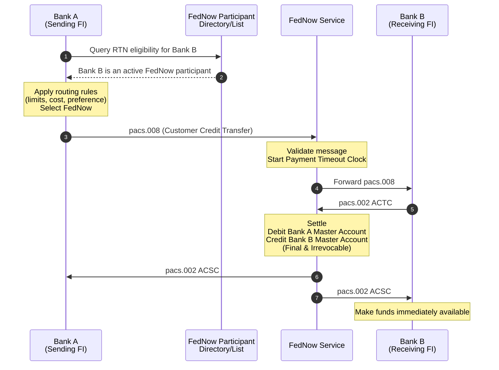
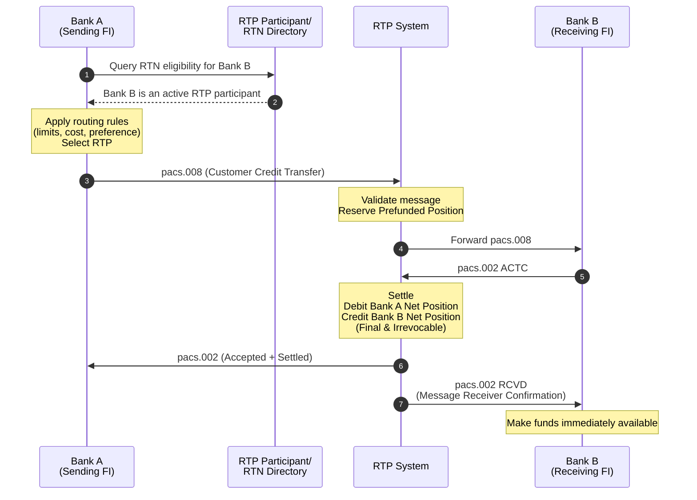
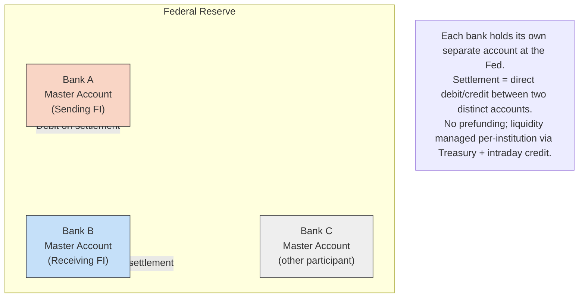
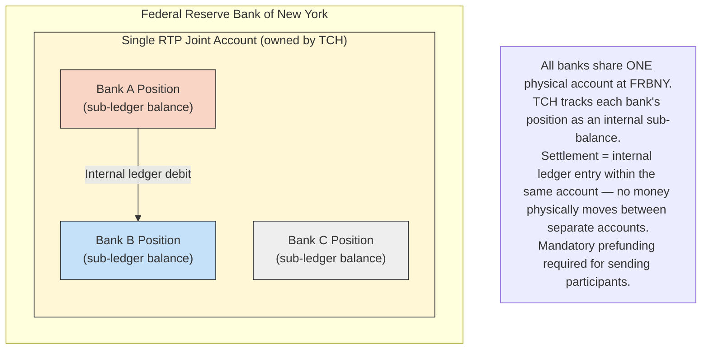
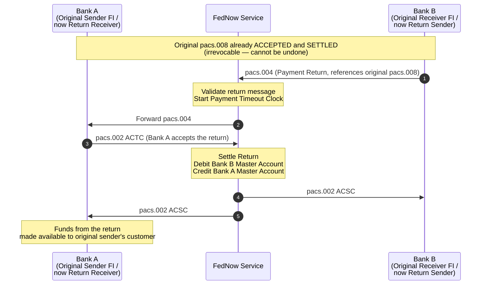
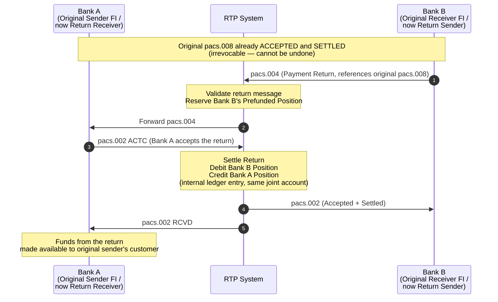
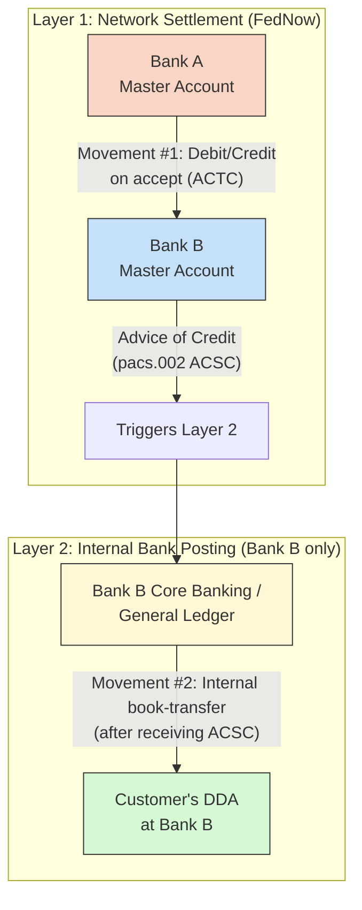
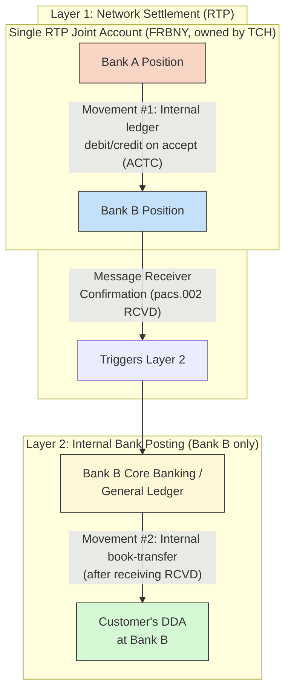
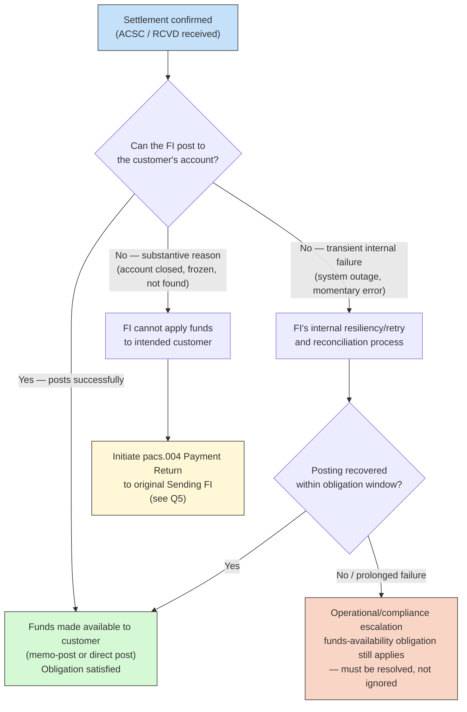

**Instant Payment Credit Transfer Process – FedNow & TCH RTP**

---

### 1. Document Control

| Item              | Details                          |
|-------------------|----------------------------------|
| Document Title    | Instant Payment Credit Transfer Process – FedNow & TCH RTP |
| Version           | 1.1                              |
| Date              | August 2026                      |
| Status            | Draft                            |
| Classification    | Internal                         |
| Document Owner    |                                  |
| Reviewers         |                                  |

**Change History**

| Version | Date       | Author | Description                |
|---------|------------|--------|----------------------------|
| 1.0     | Aug 2026   |        | Initial version            |
| 1.1     | Aug 2026   |        | Added participant/routing lookup step to sequence flows; added source document appendix |

---

### 2. Purpose and Scope

**Purpose**  
This document describes the end-to-end process for Customer Credit Transfers (instant payments) using the ISO 20022 `pacs.008` message across the two major US real-time payment networks: **FedNow Service** and **TCH RTP Network**.

**Scope**  
- Sending FI participant/routing eligibility lookup (pre-submission)
- Customer Credit Transfer (`pacs.008`)
- Happy Path flow between two financial institutions
- Settlement mechanics
- Funds availability rules
- Role perspective (Sending FI vs Receiving FI)
- Key differences between FedNow and TCH RTP

**Out of Scope**  
- Request for Payment (`pain.013`)
- Payment Returns
- FI-to-FI Credit Transfers (`pacs.009`)
- Detailed exception handling (to be covered in a separate document)

---

### 3. Key Concepts and Definitions

| Term                        | Definition |
|----------------------------|----------|
| Sending FI / Debtor FI     | The financial institution that initiates the credit transfer on behalf of its customer |
| Receiving FI / Creditor FI | The financial institution that receives the credit transfer for its customer |
| FedNow                     | Federal Reserve real-time gross settlement service |
| TCH RTP                    | The Clearing House Real-Time Payments network |
| Master Account             | Account held at a Federal Reserve Bank (used in FedNow) |
| Prefunded Net Position     | Liquidity position maintained at TCH (used in RTP) |
| Routing Transit Number (RTN) | 9-digit code identifying a specific financial institution/processing point for payment routing |
| Participant Directory      | The authoritative, network-published list of RTNs enabled to send/receive on a given rail |
| `pacs.008`                 | ISO 20022 Customer Credit Transfer message |
| `pacs.002`                 | ISO 20022 Payment Status Report message |

**Key Status Codes**

| Status | Meaning                          | Used In      |
|--------|----------------------------------|--------------|
| ACTC   | Accepted Technical Validation    | Both         |
| ACSC   | Accepted Settlement Completed    | FedNow       |
| ACCC   | Accepted Credited                | FedNow (optional) |
| RCVD   | Received (Message Receiver Confirmation) | RTP     |
| RJCT   | Rejected                         | Both         |
| ACWP   | Accepted Without Posting         | Both         |

---

### 4. Generic End-to-End Happy Path Flow

#### 4.1 Process Overview

A corporate customer of Bank A instructs Bank A to send an instant payment to a corporate customer of Bank B. **Before constructing or submitting the `pacs.008`, Bank A first determines whether Bank B is reachable on the intended rail** by checking Bank B's Routing Transit Number (RTN) against that rail's Participant Directory. Only once a valid, eligible rail is confirmed does Bank A send the `pacs.008` message to the network. The network validates the message, forwards it to Bank B, receives an acceptance response, settles the payment, and notifies both parties. Bank B makes the funds available to its customer only after receiving confirmation of settlement from the network.

#### 4.2 Participant / Routing Eligibility Lookup (Pre-Submission)

This step occurs entirely on the Sending FI's side, before any message is submitted to the network.

| Step | Actor    | Action |
|------|----------|--------|
| 0.1  | Sending FI | Resolves the Receiving FI's RTN from the beneficiary account details supplied by the customer |
| 0.2  | Sending FI | Queries the relevant Participant Directory (FedNow Participant List, or TCH RTP Participant/RTN Directory) to confirm the Receiving FI's RTN is active on that rail |
| 0.3  | Sending FI | If the Receiving FI is eligible on more than one rail, applies internal routing rules (transaction amount vs. rail limits, cost, business preference) to select a single rail |
| 0.4  | Sending FI | If the Receiving FI is not eligible on any instant rail, the payment is not submitted as an instant payment (falls back to another rail, e.g. ACH/wire, or is rejected to the customer at origination) |
| 0.5  | Sending FI | Proceeds to construct and submit `pacs.008` on the selected rail |

**Notes**
- Directory lookups may be performed against the network's data directly (e.g., the Fed's published Participant List API) or against a connectivity/gateway vendor's cached copy of that directory, depending on the Sending FI's architecture.
- This lookup determines *reachability*, not funds availability or risk decisioning — those checks happen later, on the Receiving FI's side, after the message is forwarded.
- Rail limits relevant to this decision: FedNow default credit transfer limit (participant-configurable, raisable), and the TCH RTP per-transaction ceiling (see Section 8 for current values, subject to change — confirm against network documentation before relying on a figure in this table).

#### 4.3 Sequence Diagram – FedNow

#### 4.4 Sequence Diagram – TCH RTP

#### 4.5 Detailed Step-by-Step Table

| Step | Actor          | Action / Message                          | FedNow                                      | TCH RTP                                          |
|------|----------------|--------------------------------------------|---------------------------------------------|--------------------------------------------------|
| 0    | Sending FI     | Queries Participant Directory for Receiving FI's RTN | FedNow Participant List | TCH RTP Participant/RTN Directory |
| 1    | Sending FI     | Sends `pacs.008`                          |                                             |                                                  |
| 2    | Network        | Validates the message                     | Schema, signature, limits, participant status, fraud checks | Same + Prefunded position check and reservation |
| 3    | Network        | Forwards `pacs.008` to Receiving FI       |                                             |                                                  |
| 4    | Receiving FI   | Responds with `pacs.002 ACTC`             |                                             |                                                  |
| 5    | Network        | Performs Settlement                       | Debits Sending FI Master Account Credits Receiving FI Master Account | Debits Sending FI Net Position Credits Receiving FI Net Position |
| 6    | Network        | Sends confirmation                        | `pacs.002 ACSC` to both parties             | Response to Sending FI + `pacs.002 RCVD` to Receiving FI |
| 7    | Receiving FI   | Makes funds available to customer         | After receiving `ACSC`                      | After receiving `RCVD` Confirmation              |

---

### 5. Settlement Mechanics

**FedNow**  
- Settlement occurs on the Federal Reserve Master Accounts of the participants.  
- The Sending FI's Master Account is debited and the Receiving FI's Master Account is credited.  
- Settlement is final and irrevocable once the debit and credit are recorded (or when the Advice of Credit is sent).

**TCH RTP**  
- Settlement occurs against prefunded Net Positions maintained by participants at The Clearing House.  
- The Sending FI's Net Position is debited and the Receiving FI's Net Position is credited.  
- Settlement is final and irrevocable upon successful processing of the Accept response by the RTP System.

---

### 6. Funds Availability Rules

**Core Principle**  
The Receiving FI must **not** make funds available to its customer until it has received confirmation from the Network that settlement has been completed.

| Network   | Trigger Message Received by Receiving FI | Status Code | Obligation |
|-----------|--------------------------------------------|-------------|----------|
| FedNow    | `pacs.002` from FedNow                   | **ACSC**    | Make funds immediately available |
| TCH RTP   | Message Receiver Confirmation from RTP   | **RCVD**    | Make funds immediately available |

Making funds available before receiving the Network confirmation is a violation of the respective network rules.

---

### 7. Role Perspective

#### 7.1 When the Bank is the Sending FI (Outbound)

- Queries the applicable Participant Directory to confirm Receiving FI eligibility before submission
- Initiates the payment by sending `pacs.008`
- Receives final status via `pacs.002`
- Notifies its customer of success or failure
- Experiences a debit to its liquidity position / Master Account

#### 7.2 When the Bank is the Receiving FI (Inbound)

- Receives `pacs.008`
- Performs validation and decides to Accept, Reject, or Accept Without Posting
- Sends `pacs.002 ACTC` (in happy path)
- **Must wait** for Network confirmation (`ACSC` or `RCVD`) before making funds available
- Experiences a credit to its liquidity position / Master Account

---

### 8. Key Differences: FedNow vs TCH RTP

| Area                         | FedNow                                      | TCH RTP                                          |
|------------------------------|-----------------------------------------------|----------------------------------------------------|
| Settlement Model             | Real-time gross settlement on Master Accounts | Prefunded Net Positions                          |
| Confirmation to Receiving FI | `pacs.002 ACSC`                             | `pacs.002 RCVD` (Message Receiver Confirmation)  |
| Funds Availability Trigger   | Receipt of `ACSC`                           | Receipt of `RCVD` Confirmation                   |
| Liquidity Management         | Master Account + possible intraday credit   | Mandatory prefunding                             |
| Timeout Mechanism            | Payment Timeout Clock + reserved response time | Fixed system timeout window                    |
| Posting Confirmation         | Optional `ACCC` from Receiving FI           | Not part of core happy path                      |
| Participant Directory Source | Published by the Federal Reserve (FedNow Participant List) | Published/distributed by TCH (member access) |

---

### 9. Exception Flows (Summary)

| Scenario                  | Description                                      | Network Action                          |
|---------------------------|--------------------------------------------------|-----------------------------------------|
| Receiving FI not on rail  | Participant Directory lookup finds no match for the rail | Sending FI does not submit on that rail; selects an alternate rail or channel |
| Rejection (RJCT)          | Receiving FI declines the payment                | No settlement occurs                    |
| Accept Without Posting (ACWP) | Receiving FI needs more time for compliance screening | Settlement may still occur; final decision later |
| Timeout                   | Receiving FI does not respond in time            | Network rejects the payment             |

Detailed exception flows will be maintained in a separate document.

---

### 10. Message and Status Code Reference

**Primary Messages**
- `pacs.008` – Customer Credit Transfer (initiation)
- `pacs.002` – Payment Status Report (responses and confirmations)

**Common Status Codes**

| Code  | Full Name                        | Typical Usage                          |
|-------|----------------------------------|----------------------------------------|
| ACTC  | AcceptedTechnicalValidation      | Receiving FI accepts the payment       |
| ACSC  | AcceptedSettlementCompleted      | FedNow confirms settlement             |
| ACCC  | AcceptedCustomerCredited         | Optional confirmation of posting       |
| RCVD  | Received                         | RTP Message Receiver Confirmation      |
| RJCT  | Rejected                         | Payment declined                       |
| ACWP  | AcceptedWithoutPosting           | Compliance hold                        |

---

### 11. Related Documents and References

**FedNow — Official Federal Reserve Sources**
- FedNow Service Operating Procedures (authoritative rules document): https://www.frbservices.org/binaries/content/assets/crsocms/resources/rules-regulations/0624-fednow-service-operating-procedures.pdf
- FedNow Service Operating Procedures (later revision — verify current version on FRBservices.org): https://frbservices.org/binaries/content/assets/crsocms/resources/rules-regulations/062425-fednow-service-operating-procedures.pdf
- FedNow Readiness Guide — Payment Flow Process & Funds Availability: https://explore.fednow.org/resources/readiness-guide-fund-availability.pdf
- FedNow Readiness Guide — Understanding the Payment Timeout Clock: https://explore.fednow.org/resources/readiness-guide-understanding-the-payment-timeout-clock.pdf
- FedNow Readiness Guide — ISO 20022 Messages Overview: https://explore.fednow.org/resources/readiness-guide-iso-20022.pdf
- FedNow Guide to Liquidity Management Transfers: https://explore.fednow.org/resources/fednow-liquidity-management-transfers-guide.pdf
- FedNow resource hub (all readiness guides): https://explore.fednow.org/resources
- FedNow APIs overview (Participant List API, Ping, balance, fraud data insight APIs): https://www.frbservices.org/fedline-solutions/fedline-developer/fednow-apis
- FedNow Participating Financial Institutions & RTN lists (XLSX downloads, updated regularly): https://www.frbservices.org/financial-services/fednow/organizations

**TCH RTP — Official Sources**
- RTP Operating Rules (October 2017 version located during drafting — confirm latest version with TCH): https://www.theclearinghouse.org/payment-systems/rtp/-/media/6de51d50713841539e7b38b91fe262d1.ashx
- RTP network overview: https://www.theclearinghouse.org/payment-systems/rtp/
- RTP Participants and Routing/Transit Numbers directory (requires TCH member login): https://www.theclearinghouse.org/payment-systems/rtp/rtn
- U.S. Real-Time Payments Technology Playbook (TCH): https://www.persistent.com/wp-content/uploads/2022/02/tch-rtp-technology-playbook-111716-v1.pdf
- U.S. Real-Time Payments Operations Playbook (TCH): https://www.persistent.com/wp-content/uploads/2022/02/tch-rtp-operations-playbook-v101-2-11716.pdf

**ISO 20022 Message Specifications**
- SWIFT MyStandards platform (formal FedNow ISO 20022 message specs, field-level detail, status code values — free registration required): https://www.swift.com/mystandards

**Internal**
- Internal System Integration Specifications (link to be added by document owner)
- Connectivity/gateway vendor API specification, if applicable (link to be added by document owner)

> **Note on source currency:** Several links above point to Federal Reserve and TCH documents that are revised periodically. Before relying on any specific figure, timeout value, or status code cited in this document for build purposes, confirm against the current version of the source document, not this document's snapshot of it.

---

### 12. FAQ

**Q1: What is FedNow? Who owns FedNow? What is its history, and when was it established?**

FedNow is a real-time gross settlement service for instant interbank payments, built and operated by the **Federal Reserve** — it is a real-time payment system between banks built and operated by the Federal Reserve, allowing banks to send and receive payments in seconds, 24 hours a day, seven days a week. It is owned and run by the US central bank, not a private company or bank consortium — the same institution that operates Fedwire and FedACH, not a new or separate entity.

*Ownership:* Owned and operated directly by the Federal Reserve Banks (the twelve regional Reserve Banks under the Federal Reserve System) — it is a payment service the Federal Reserve makes available for banks and credit unions to transfer funds for their customers, alongside its existing Fedwire and FedACH services.

*History and timeline:*
- The Federal Reserve announced its decision to develop the FedNow Service in 2019, following requests for public comment in 2018 and 2019.
- Groundwork began with a pilot program initiated in January 2021, involving over 110 banks and payment processors.
- The launch window was progressively narrowed from 2023/2024 to mid-2023, then formally announced on March 15, 2023 as a July 2023 launch, with early-adopter certification completing in June 2023.
- **FedNow officially launched on July 20, 2023**, going live with 35 early-adopting banks and credit unions plus the U.S. Department of the Treasury's Bureau of the Fiscal Service, supported by 16 service providers.
- Total implementation investment was approximately $545 million, covering new cloud-based infrastructure and integration with existing Federal Reserve account systems.
- FedNow is described as the Federal Reserve's first new payment rail in 50 years, launching roughly six years after TCH's competing RTP network (2017).

**Q2: What is TCH RTP? Who owns RTP? What is its history?**

RTP is the real-time payments network operated by **The Clearing House (TCH)** — a system launched and operated by The Clearing House in 2017, processing U.S. domestic payments 24/7 with immediate settlement, and open to any federally insured U.S. depository institution.

*Ownership:* RTP is privately owned, not a government system. It operates as a privately held system, owned by the largest commercial banks such as Bank of America, TD Bank, BNY Mellon, and others — TCH itself is owned by roughly 24-25 of the largest banks in the U.S. RTP is a product of The Clearing House Payments Company L.L.C., a banking association and payments company owned by these large commercial banks. Importantly, membership in The Clearing House is no longer required for RTP participation — any federally insured depository institution can join even without being one of the owner-banks.

*History:*
- The Clearing House itself dates back to October 4, 1853 (originally the New York Clearing House), with founding banks including JPMorgan Chase, Bank of America, Citigroup, BNY, Deutsche Bank, U.S. Bancorp, and Wells Fargo — historically functioning as a proto-central-bank before the Federal Reserve was created in 1914.
- The RTP system was designed and built through the collaborative effort of TCH's owner banks (25 at launch) and was built to meet the objectives of the Federal Reserve's Faster Payments Task Force.
- **RTP launched on November 14, 2017** — the first new core payments infrastructure in the U.S. in more than 40 years, with the first live payment initiated between BNY Mellon and U.S. Bank, quickly followed by Citi, JPMorgan, PNC, and SunTrust as early adopters.
- RTP was designed and is powered by Mastercard, which remains the exclusive instant payments software provider for TCH's RTP network under an extended multi-year partnership.
- RTP launched roughly six years before FedNow (2017 vs. 2023) and has grown substantially since: as of 2025-26 reporting, RTP covers more than 1,100 participating banks and processed $1.3 trillion in 2025, up 428% from 2024, partly driven by the per-transaction limit increase from $1 million to $10 million in February 2025.

**Q3: How does FedNow settlement work vs. RTP? FI Master Account in FedNow vs. RTP positions/account.**

The two networks use fundamentally different settlement models, even though both are "real-time" and both are final/irrevocable once settled.

*FedNow — settles via individual Fed Master Accounts:*
- Each participating bank settles through its own Federal Reserve Master Account (or a correspondent's, if it doesn't hold one directly) — direct bilateral settlement, bank to bank, each with its own separate account at the Fed.
- No prefunding requirement — settlement occurs in the participant's ordinary reserve/master account, the same account used for Fedwire, FedACH, and other Fed services, not a separate dedicated pool.
- The Fed does not check or reject messages for insufficient balance; it relies on the sending institution's own real-time Treasury/liquidity management, backed by intraday credit/overdraft facilities, with a discretionary institution-level circuit breaker as backstop.
- Settlement is triggered by the Receiving FI's accept response (`pacs.002 ACTC`); FedNow then debits the Sending FI's Master Account and credits the Receiving FI's Master Account, and sends a confirming `pacs.002 ACSC` to each side.

*RTP — settles via a single shared joint account with per-bank sub-positions:*
- All RTP participants settle through one single joint account held at the Federal Reserve Bank of New York, owned collectively by TCH — not separate accounts per bank.
- Each bank maintains its own Current Prefunded Position (CPP) — a ledger sub-balance within that one joint account, not a separate physical account.
- RTP requires mandatory prefunding: each sending-capable bank must maintain a TCH-determined minimum position before it can send; receive-only participants have no prefunding requirement.
- Settlement, again triggered by the Receiver's accept, is an internal debit/credit between the two banks' positions within the same joint account — no money physically moves between separate accounts. The Receiving FI then gets a distinct "Received" (`RCVD`) confirmation, not a second `ACSC`, before it is obligated to post funds.

*Core structural difference:* FedNow is **N individual accounts**, one per participant, with liquidity managed institution-by-institution against ordinary reserves. RTP is **one shared pooled account** with N internal sub-positions, funded specifically and only for RTP activity. FedNow tolerates looser real-time balance checking (backstopped by Fed credit); RTP's entire design exists to eliminate settlement risk via mandatory pre-committed collateral. Same problem — guaranteeing settlement succeeds once accepted — solved via structurally opposite mechanisms.

**Diagram — FedNow: Separate Master Accounts**

**Diagram — RTP: One Joint Account, Per-Bank Positions**

**Q4: What happens if an FI has insufficient funds — how does this work in FedNow vs. RTP?**

The two networks handle this in opposite ways, consistent with their different settlement models (Q3).

*FedNow:* The network does not check the Sending FI's balance before forwarding a payment, and does not reject messages for insufficient funds — as a general matter, the Federal Reserve Banks will not reject FedNow value messages (`pacs.008`, `pacs.004`, `pacs.009`) based on a Participant's insufficient balance or overdraft capacity. Instead:
- The Fed allows the Sending FI to run an intraday overdraft on its Master Account, with access to 24x7x365 intraday credit provided under the same terms as other Fed services.
- The Fed's control is not per-transaction — it is a discretionary, institution-level circuit breaker: a Federal Reserve Bank may temporarily prevent a Participant from sending value messages if its intraday overdraft reaches a level the Fed judges to pose heightened risk, with notification to the participant if this occurs.
- In practice, funding sufficiency is the Sending FI's own Treasury/liquidity management responsibility — not something FedNow polices transaction-by-transaction.

*RTP:* The opposite approach — RTP rejects immediately at the point of message submission if funding is insufficient, with no overdraft allowance. Per the RTP Operating Rules: if the Sending Participant's Current Prefunded Position is not sufficient to allow the RTP System to release the Payment Message, the System shall reject the Payment Message. If the position is sufficient, the System reserves the amount immediately upon release — recording entries to decrease the Sending Participant's Net Position and Current Prefunded Position so that the position cannot be reduced below the reserved amount until the payment is cancelled, rejected, or settled. This reservation mechanism prevents the same funds from being committed to two simultaneous outgoing payments while either is in flight.

*Summary contrast:* FedNow is permissive-then-managed (message proceeds regardless of balance; risk is managed after the fact via overdraft and institutional oversight). RTP is preventive-and-immediate (message is rejected outright, with zero tolerance, unless sufficient prefunded collateral is confirmed and reserved before the message is even released to the Receiving FI). This is a direct consequence of RTP's core design goal — a prefunded model exists specifically to eliminate settlement risk, so allowing an overdraft would defeat its purpose; FedNow, settling through ordinary Fed reserve balances, extends the same overdraft/intraday-credit tools available across all Fed services.

**Q5: The payment is irrevocable — is there any provision for refund? If yes, how does this work for FedNow and RTP?**

Yes, both networks provide a formal **return** mechanism — but it is important to be precise about what this is and is not: it is a **new, separate payment sent in the opposite direction**, not a reversal or cancellation of the original irrevocable transaction. The original settlement stands; a return is a voluntary, cooperative act by the Receiving FI to send the money back.

*The message used: `pacs.004` (Payment Return), on both networks.* This is distinct from `pacs.002`, which is only used to reject a payment before it settles. Reject (`pacs.002`) is used when a transaction is not yet settled; Return (`pacs.004`) is used to return funds after a transaction has already settled.

*FedNow specifics:*
- FedNow explicitly supports `pacs.004` as a first-class value message alongside `pacs.008` and `pacs.009`. A payment return is used to refund the amount of a payment previously sent — this may occur when the Receiver FI either cannot apply the funds from the original credit transfer or chooses to return the amount.
- A `pacs.004` return goes through the same accept/reject/settlement mechanics as an ordinary payment: once the Receiver FI (now the original Sender, in the reversed direction) receives the `pacs.004`, it must respond via `pacs.002` (Accept/Reject/ACWP), and an accepted return settles through Master Accounts exactly like an original payment, just with the direction reversed and referencing the original transaction.
- This means the original sender, now receiving the return, could in principle reject or delay accepting it too — though in practice returns are typically cooperative.

*RTP specifics:*
- RTP uses the same `pacs.004` mechanism. TCH maintains a specific governed rule for this scenario, titled "Returning Funds After Providing an Accept Response to a Credit Transfer" (effective 07-25-2024), confirming a bank that has already accepted (and therefore settled) a credit transfer can still initiate a return afterward.
- Structurally, since RTP settlement is a debit/credit against Current Prefunded Positions, a `pacs.004` return simply reverses that ledger entry — debiting the original Receiver's position and crediting the original Sender's position — the same mechanism as a normal payment, just with the roles reversed.

*Critical practical caveat:* a return is **voluntary and cooperative** — there is no network-level compulsion forcing a Receiving FI to send one; it depends entirely on that FI choosing to initiate it. There is no unilateral recall on either network. This is precisely why real-time sanctions screening before accepting (see Q3/Q4, and the ACWP discussion elsewhere in this document) matters so much: once a payment is accepted, a "refund" is no longer guaranteed — it depends on cooperation, not entitlement.

**Diagram — Return Flow After Settlement (`pacs.004`), FedNow**

**Diagram — Return Flow After Settlement (`pacs.004`), RTP**

**Key takeaway to highlight in the diagrams:** the return is structurally identical to an ordinary credit transfer — same message types, same accept/reject/settlement pattern, same funds-availability trigger rules from Q3 — just with the Sender/Receiver roles swapped and a reference back to the original transaction. There is no special "undo" mechanism at the network level; a return is TCH's/the Fed's ordinary payment machinery pointed in reverse, initiated only if and when the original Receiving FI chooses to.

**Q6: In the inbound flow, when does the FI accept payment, and when does money move from the Master Account to the customer's account in FedNow — and how does the position movement happen in RTP?**

This question is really about two separate, sequential movements that are easy to conflate: (1) **interbank settlement** — network-level, between the two banks' Master Accounts/positions, and (2) **internal posting** — the receiving bank's own book-transfer from its Master Account into the specific customer's account on its core banking ledger. Only movement (1) is something the network performs; movement (2) is entirely internal to the bank.

*FedNow — sequence of events:*
1. Receiving FI (Bank B) receives the `pacs.008`, runs its internal processing (idempotency, validation, account lookup, sanctions), and responds with `pacs.002 ACTC` — the accept, sent within the timeout window.
2. FedNow performs interbank settlement — Movement #1: debits Bank A's Master Account, credits Bank B's Master Account. Money now belongs to Bank B in aggregate, but has not yet reached the specific customer.
3. FedNow sends a confirming `pacs.002 ACSC` (Advice of Credit) to Bank B, and a corresponding acknowledgement to Bank A.
4. Only upon receiving that ACSC does Bank B have both the authorization and the binding obligation to perform Movement #2: an internal book-transfer on its own core banking platform, moving funds from its aggregate Master Account position into the specific beneficiary customer's DDA. This is Bank B's own general ledger operation — nothing further happens at the Fed for this leg.
5. Bank B must make funds available to the customer essentially immediately after receiving the ACSC — a network participation obligation, not a courtesy.

*RTP — sequence of events, same two-movement structure, different settlement mechanics:*
1. Receiving FI (Bank B) receives the `pacs.008`, runs the same internal processing, and responds with `pacs.002 ACTC`.
2. RTP performs settlement as Movement #1 — an internal ledger entry within the single joint account at the FRBNY: TCH decreases Bank A's Current Prefunded Position and increases Bank B's Current Prefunded Position by the payment amount. No money moves between separate accounts, since both banks' positions are sub-balances of the same shared account.
3. RTP sends Bank A a settlement confirmation, and separately sends Bank B the "Message Receiver Confirmation" carrying status `RCVD`.
4. Only upon receiving that `RCVD` confirmation does Bank B perform Movement #2 — the same kind of internal book-transfer as in FedNow, moving value from its aggregate RTP position into the specific customer's account on its own core banking ledger.
5. Bank B makes funds available to the customer immediately after this internal posting.

*Unifying point:* regardless of network, the movement into the customer's individual account is always a second, distinct, bank-internal step — never something FedNow or RTP does directly. Both networks only move value between the institutions' aggregate positions (Master Account or CPP); the institution is responsible for the final internal transfer into the named customer's account, and both networks impose a binding "make funds available immediately" obligation once their respective confirmation message (`ACSC` for FedNow, `RCVD` for RTP) is received — not before.

**Diagram — Two-Layer Settlement Structure: FedNow**

**Diagram — Two-Layer Settlement Structure: RTP**

**Q7: For outbound, what are the different channels an FI generally offers, and what is the purpose of each?**

An FI typically offers a mix of channels for a corporate or retail customer to *initiate* an outbound instant payment. Each exists to serve a different customer profile, integration capability, and volume pattern.

*1. Online/Mobile Banking Portal*
- Purpose: Human-driven, manual initiation for low-to-moderate volume — a person logs in, enters payment details, and submits.
- Typical user: Retail customers, small businesses, or a corporate user making an ad hoc/exception payment outside their normal automated flow.
- Why it exists: Universal accessibility — no technical integration required, works for every customer segment.

*2. Host-to-Host (H2H) / File-Based Integration*
- Purpose: Allows a corporate's ERP or treasury management system to submit payment instructions directly to the bank, typically via SFTP or MQ, often in batch or near-real-time file drops.
- Typical user: Large corporates with high payment volumes (payroll, supplier payments, disbursements) who need automation without building a full API integration.
- Why it exists: Reduces manual entry and human error at scale; fits corporates whose internal systems already generate structured payment files as part of existing AP/AR processes. Note: for the instant payment leg specifically to retain its speed advantage, the bank's processing of the file (parsing, validation, submission to the rail) must itself happen in near-real-time, not on a traditional batch cutoff schedule.

*3. API / Direct Integration*
- Purpose: Real-time, programmatic payment initiation — the corporate's own application calls the bank's REST/ISO 20022 API directly (e.g., submitting the equivalent of a `pain.001`) and gets an immediate response.
- Typical user: Fintechs, platforms, marketplaces, or corporates building payment initiation directly into their own software (e.g., a gig-economy payout platform, an insurance claims disbursement system).
- Why it exists: This is the natural fit for instant payments specifically — RTP and FedNow are only valuable if the initiation channel is also real-time; a delayed-batch channel would negate the speed benefit for high-value, time-sensitive use cases.

*4. File Upload / Batch Channel (Portal-Based)*
- Purpose: A corporate uploads a structured payment file (CSV, ISO 20022 XML) through a web portal rather than a full system-to-system integration, and the bank parses and originates individual payments from it.
- Typical user: Mid-sized corporates that want bulk/batch capability but don't have the technical resources for H2H or API integration.
- Why it exists: A middle ground — more automation than manual portal entry, less integration effort than H2H or API. As with H2H, the bank's own internal processing of the uploaded file must happen promptly for individual payments within it to still realize instant-payment speed.

*5. Branch / Back-Office / Assisted Channel*
- Purpose: Manual initiation by a bank employee on behalf of a customer — typically for exceptions, non-digital customers, or customer service-assisted corrections.
- Typical user: Customers without digital access, or exception-handling scenarios (e.g., a payment that failed elsewhere and needs manual reinitiation).
- Why it exists: A fallback/completeness channel, not a primary volume driver, but often a regulatory or customer-service necessity.

*Note on SWIFT:* SWIFT is not an instant payment rail and is not a channel for originating a domestic RTP/FedNow payment directly — it is a separate, non-interoperable messaging network historically used for cross-border wires and correspondent banking. The only place SWIFT intersects with an instant-payments discussion is a last-mile conversion scenario: a cross-border payment may arrive at a US bank via SWIFT, and that bank may then choose to complete the domestic leg to the ultimate beneficiary using RTP or FedNow rather than a traditional domestic wire or ACH. In that case, SWIFT is the separate inbound cross-border channel, and RTP/FedNow is a subsequent, distinct domestic instant payment — not something SWIFT itself performs.

*Relevance to platform design:* regardless of which channel is used, all of them should converge into the same internal payment representation before reaching the core workflow engine (idempotency, validation, sanctions, account lookup, rail selection). The channel layer's job is purely to normalize disparate input formats into one canonical internal instruction, so channels can be added or retired without touching the core workflow.

**Q8: After accepting a payment, what happens if the customer's account fails to be credited by the FI?**

This is an important scenario, and it is important to be precise: from the network's perspective, nothing goes wrong — settlement between the two banks already completed the moment the Receiving FI sent its accept and the network confirmed (`ACSC`/`RCVD`). A failure to post to the specific customer's account afterward is entirely a problem internal to the Receiving FI, not something FedNow or RTP can detect, prevent, or automatically fix.

*What the FI is obligated to do regardless:*
- Under Regulation J and Operating Circular 8, a Receiver FI is required to make funds available as soon as is practicable and no more than a few seconds after receipt of the advice, with the ACWP exception. This obligation exists independent of the FI's internal systems working correctly — a technical failure on the bank's side does not relieve it of the funds-availability requirement to the customer.
- The Fed explicitly does not mandate exactly how this is done: an FI could meet the availability standard by memo-posting (funds included in the customer's balance even before full ledger posting) or by direct posting, so long as the funds are available for the customer to use. This flexibility matters operationally — if a full ledger-posting pipeline fails, memo-posting to the customer's visible balance may be a valid fallback path to still meet the obligation.

*If the posting genuinely cannot be completed to that specific account* (e.g., account closed, frozen, or some validation the bank's core system rejects post-settlement): the money the bank received in aggregate at its Master Account/position is already legally the bank's, since settlement is final. The bank cannot simply "un-receive" it. The appropriate path is the same `pacs.004` return mechanism discussed in Q5 — the receiving bank originates a return, sending the money back to the original sender, since it is unable to apply it to the intended recipient.

*Two distinct failure sub-scenarios worth separating:*
1. **Transient internal failure** (system down, momentary error) — the FI's own resiliency/retry/reconciliation design must ensure posting eventually completes, since the funds-availability obligation to the customer does not pause for this. This is where a durable-write-before-accept design (recording the posting obligation before transmitting the accept) matters most.
2. **Substantive inability to post** (account closed, frozen, does not exist) — this converts into a `pacs.004` return obligation back to the original sender, since the bank cannot retain funds it cannot apply to the intended customer.

*Genuine gap worth flagging:* the sources describe the FI's obligation (make funds available promptly, or return if unable to apply) but do not spell out a specific network-mandated recovery procedure for a transient internal system failure at the exact moment of posting. That gap is filled by the bank's own operational resilience design, not by FedNow or RTP rules.

**Diagram — Decision Flow: Posting Failure After Acceptance**

---

### 13. Appendix

**A. Glossary**  
(See Section 3)

**B. Status Code Quick Reference**  
(See Section 10)

**C. Source Document Links**  
(See Section 11)

**D. Diagram Source**  
All diagrams in this document are created using Mermaid syntax and can be rendered in compatible tools (GitHub, Confluence, Notion, VS Code, etc.).

---

**End of Document**
